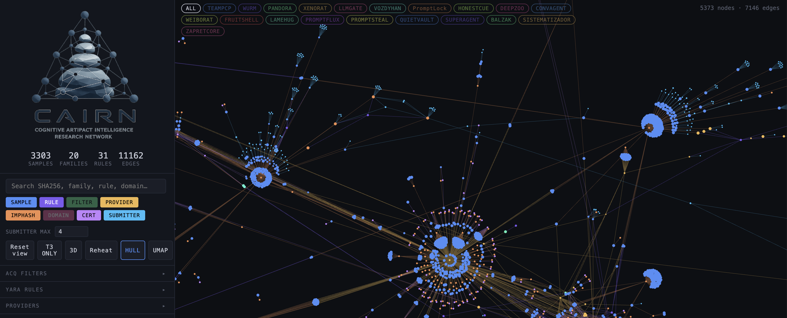

# CAIRN

**Cognitive Artifact Intelligence Research Network**

CAIRN is a research toolkit for identifying, attributing, and tracking AI-related artifacts embedded in malware. It works exclusively from VirusTotal metadata — no binary downloads, no detonation. Its central thesis is that AI-enabled malware leaves identifiable *cognitive artifacts* (hardcoded prompts, LLM API callouts, agent orchestration logic, AI-analysis evasion strings, provider key prefixes) that can be extracted, classified, and studied without touching the binary itself.

The open-source repo does not contain the SQL-lite database of findings due to copyright. Users with a VT API key can rebuild the database from the published report hashes and acquisition filters.

CAIRN combines a tiered YARA ontology over structured VT scan text with embedding-based semantic clustering and relationship graph construction — producing explainable, provenance-tracked attribution for confirmed AI-malware families.

<p align="center"></p>

---

- Launch blog: [Talos Tech Blog]
- CLOSEDQUORUM: [Link to CQ Blog]

---

## How It Works

CAIRN does not run YARA rules on raw binary content. Instead, it builds a structured text representation — *scan text* — from each VT file report by aggregating:

- File names, tags, type description, signature info
- AV detection result strings
- Crowdsourced YARA and IDS results
- ExifTool PE resource strings (FileDescription, CompanyName)
- Sigma analysis results including PS1 ScriptBlockText (Event ID 4104)
- Sandbox behavioral data: DNS lookups, HTTP conversations, memory pattern URLs, files dropped, processes created (via `--deep` or `--behaviours`)
- Relationship objects: embedded URLs, contacted domains and IPs

YARA rules match against this composed text, making every hit traceable to a named VT metadata field. The analyst always knows *why* a sample matched, not just *that* it matched.

### Processing Pipeline

```mermaid
flowchart LR
    %% ── Acquisition ──────────────────────────────────────────────
    subgraph ACQ["  Acquisition  "]
        F(["🔍 Filter channel\ncairn pull --filter &lt;slug&gt;"])
        PV(["🔗 Pivot seed\ncairn pivot &lt;sha256 / domain / ip&gt;"])
    end

    %% ── VT API ───────────────────────────────────────────────────
    subgraph VTAPI["  VirusTotal API  "]
        VTR[/"File report\nmetadata · AV · crowdsourced"/]
        VTB[/"+ Sandbox behaviours\n--deep / --behaviours"/]
    end

    %% ── Scan Text ────────────────────────────────────────────────
    subgraph SCANTEXT["  Scan Text Extraction  "]
        ST[["names · AV labels · PE strings\nembedded URLs · sandbox IOCs\nScriptBlockText"]]
    end

    %% ── YARA ─────────────────────────────────────────────────────
    subgraph YARAONT["  YARA Ontology  "]
        T1["T1 · Primitive Artifacts\nAPI endpoints · key prefixes\nprompt residue · runtime refs"]
        T2["T2 · Behavioral Context\nco-occurrence patterns\nshell + LLM · evasion + offense"]
        T3["T3 · Operational Families\nfamily attribution\nseed-anchored rules"]
        T1 --> T2 --> T3
    end

    %% ── Corpus ───────────────────────────────────────────────────
    subgraph STORE["  Corpus  "]
        DB[("SQLite\ndata/cairn.sqlite")]
    end

    %% ── Semantic layer ───────────────────────────────────────────
    subgraph SEMANTIC["  Semantic Similarity  "]
        EMB["Embedding encode\nsentence-transformers"]
        CLU["HDBSCAN clustering\ncairn cluster"]
        NEAR["Nearest-neighbour\ncairn near"]
        EMB --> CLU
        EMB --> NEAR
    end

    %% ── Outputs ──────────────────────────────────────────────────
    subgraph OUT["  Outputs  "]
        REPORT(["📄 Findings report\nCSV + markdown"])
        GRAPH(["🕸️ Relationship graph\nJSON"])
        FAMILY(["📋 Family report\ndocs/FAMILY.md"])
        SOA(["🗂️ Archetype taxonomy\ndocs/SOA.md"])
    end

    %% ── Secondary input ──────────────────────────────────────────
    PI(["📡 PromptIntel feed\ncairn sync-promptintel"])

    %% ── Edges: core path ─────────────────────────────────────────
    F -->|cairn pull| VTR
    PV -->|cairn pivot| VTR
    VTR --> VTB
    VTR --> ST
    VTB -.->|optional| ST
    ST --> T1
    T3 --> DB
    T1 & T2 --> DB
    DB --> EMB
    DB --> REPORT
    DB --> GRAPH
    DB --> FAMILY
    FAMILY --> SOA

    %% ── Edges: secondary ─────────────────────────────────────────
    PI -.->|binary-relevant IOCs| DB

    %% ── Subgraph styles (dotted borders) ─────────────────────────
    style ACQ      fill:none,stroke:#4a9eff,stroke-width:1.5px,stroke-dasharray:6 3,color:#4a9eff
    style VTAPI    fill:none,stroke:#3dba6f,stroke-width:1.5px,stroke-dasharray:6 3,color:#3dba6f
    style SCANTEXT fill:none,stroke:#4a9eff,stroke-width:1.5px,stroke-dasharray:6 3,color:#4a9eff
    style YARAONT  fill:none,stroke:#ff6b6b,stroke-width:1.5px,stroke-dasharray:6 3,color:#ff6b6b
    style STORE    fill:none,stroke:#4a9eff,stroke-width:1.5px,stroke-dasharray:6 3,color:#4a9eff
    style SEMANTIC fill:none,stroke:#a855f7,stroke-width:1.5px,stroke-dasharray:6 3,color:#a855f7
    style OUT      fill:none,stroke:#f0c040,stroke-width:1.5px,stroke-dasharray:6 3,color:#f0c040

    %% ── Node styles ──────────────────────────────────────────────
    classDef core     fill:#1e3a5f,stroke:#4a9eff,stroke-width:2px,color:#e8f4ff
    classDef vt       fill:#1a3a2a,stroke:#3dba6f,stroke-width:2px,color:#e8fff0
    classDef yara     fill:#3a1e1e,stroke:#ff6b6b,stroke-width:2px,color:#ffe8e8
    classDef semantic fill:#2a1e3a,stroke:#a855f7,stroke-width:2px,color:#f5e8ff
    classDef output   fill:#2a2a1e,stroke:#f0c040,stroke-width:2px,color:#fffde8
    classDef secondary fill:#1a1a1a,stroke:#666,stroke-width:1px,stroke-dasharray:4 4,color:#aaa

    class F,PV core
    class VTR,VTB vt
    class ST,DB core
    class T1,T2,T3 yara
    class EMB,CLU,NEAR semantic
    class REPORT,GRAPH,FAMILY,SOA output
    class PI secondary
```



### Three-Tier YARA Ontology

Rules are organized into three tiers of increasing specificity:

| Tier | Purpose | Example |
|---|---|---|
| **T1 — Primitive Artifacts** | Individual cognitive artifacts; high recall, FPs expected | `T1-LLM_API_Endpoint`, `T1-LLM_API_Key_Hardcoded` |
| **T2 — Behavioral Context** | Two or more co-occurring primitives in an operationally meaningful combination | `T2-AI_Decoy_Prompt_In_Malware`, `T2-Agentic_Offensive_Tasking` |
| **T3 — Operational Families** | Family-level attribution anchored to confirmed seed hashes | `T3-TEAMPCP_Backdoored_LiteLLM_Proxy`, `T3-HONESTCUE_LLM_Probe_Loader` |

Current rule counts: **9 T1 / 8 T2 / 8 T3** — 25 total.

---

## Requirements

- Python 3.11+
- [VirusTotal Intelligence API key](https://www.virustotal.com/gui/my-apikey) — a VirusTotal Intelligence subscription is required for content-based search queries (`content:` clauses)
- Optional: PromptIntel API key for IOC feed sync

---

## Installation

```bash
git clone https://github.com/fetterm4n/CAIRN.git
cd CAIRN
python -m venv .venv && source .venv/bin/activate
pip install -e ".[dev]"
cp .env.example .env
# Edit .env — set VT_API_KEY (required) and PROMPTINTEL_API_KEY (optional)
```

For embedding-based clustering:

```bash
pip install -e ".[embed]"
```

Verify the install:

```bash
cairn validate-rules    # should report 44 rules, valid: true
cairn filters           # should list all channels with enabled status
```

---

## Quick Start

```bash
source .venv/bin/activate

# Pull 25 samples from the python-ai-scripts channel
cairn pull --filter python-ai-scripts --limit 25

# Check what fired
cairn summary

# Deep-dive a specific sample (fetches sandbox behavioural data)
cairn refresh --sha256 <sha256> --behaviours

# Re-run all rules against the corpus after editing yara_rules.yar — no API calls
cairn rescan

# Validate known seed samples still fire their expected rules
cairn validate-seeds
```

---

## CLI Reference

### Acquisition

```bash
cairn filters                                          # list channels and key status
cairn pull --filter <slug> --limit 25                 # pull one filter
cairn pull --filter <slug> --limit 25 --deep          # include sandbox behaviours
cairn pull --filter <slug> --date-clause "fs:7d+"     # restrict by first-seen date
cairn pull-enabled --limit 50                         # pull all enabled filters
```

### Corpus and Refresh

```bash
cairn summary                                          # corpus stats and rule hit counts
cairn refresh --sha256 <sha256>                       # re-fetch VT data, re-run YARA
cairn refresh --sha256 <sha256> --behaviours          # also pull sandbox data
```

### Pivot

```bash
cairn pivot <sha256>                                   # pivot similar_files (default)
cairn pivot <sha256> --rel communicating_files         # files sharing network IOCs
cairn pivot <sha256> --rel dropped_files --deep        # files dropped in sandbox
cairn pivot <domain>                                   # files that contacted this domain
cairn pivot <ip>                                       # files that contacted this IP
cairn pivot-urls <sha256>                              # resolve embedded_url objects
```

Seed type is auto-detected: 64 hex chars → file, four octets → IP, anything else → domain.

### Rules and Seeds

```bash
cairn validate-rules                                   # parse YARA, check tier structure
cairn rescan                                           # re-run rules against corpus
cairn seed-add --sha256 <sha256> --family <NAME> \
  --expect <T3-RULE_NAME>                             # register a known-good seed
cairn validate-seeds                                   # pass/fail expected-rule check
```

### Embeddings and Clustering

```bash
cairn embed                                            # encode scan_text to vectors
cairn embed --reembed                                  # re-encode existing embeddings
cairn cluster --min-cluster-size 3                    # HDBSCAN over stored vectors
cairn cluster-summary                                 # summarise clusters; suppresses dead-end noise by default
cairn cluster-summary --include-dead-ends             # include clusters flagged in dead_end_hashes.txt
cairn cluster-summary --unknown-only                  # only clusters with no T3 family attribution
cairn project                                         # project embeddings to 2D (t-SNE / UMAP)
cairn near <sha256> --top 10                          # nearest neighbours for a hash
```

### Explorer

```bash
cairn explorer                                        # launch local graph + UMAP UI in browser
cairn explorer --port 8422 --no-browser               # custom port, no auto-open
```

### Export and Reporting

```bash
cairn report                                           # CSV + markdown findings draft
cairn graph                                            # relationship graph JSON
cairn graph --output outputs/graphs/cairn_graph.json
```

### Corpus Maintenance

```bash
cairn threads                                          # list open THREADS.md leads
cairn fetch-submitters                                 # backfill VT submitter keys
cairn prune                                            # remove samples listed in config/exclusions.yaml
cairn prune --dry-run                                  # preview what would be removed
```

### PromptIntel Feed

```bash
cairn sync-promptintel                                 # sync feed, report new binary-relevant records
cairn sync-promptintel --all                           # print all stored IOCs
```

---

## Acquisition Channels

Twenty-seven named channels in `config/acquisition_filters.yaml` (one disabled). Each represents a separate hypothesis and measures yield independently.

| Slug | Category | File Types | Min Det. | Notes |
|---|---|---|---|---|
| `broad-discovery` | discovery | peexe, pedll | 5 | High-recall sweep for any AI/LLM reference |
| `prompt-residue` | prompt | peexe, pedll | 5 | Role markers, jailbreak strings, task-instruction residue |
| `agentic-tooling` | agentic | peexe, pedll, ps1, py, js | 5 | Named agent framework references and orchestration terms |
| `local-llm-runtime` | runtime | peexe, pedll | 5 | Local or open-weight inference runtime references |
| `provider-api-integration` | api | peexe, pedll | 5 | Hosted LLM provider endpoints and SDK call signatures |
| `ai-analysis-evasion` | evasion | peexe, pedll | 5 | Strings designed to suppress AI-assisted analysis |
| `offensive-co-occurrence` | offensive | peexe, pedll | 5 | AI terminology co-occurring with offensive tradecraft |
| `powershell-ai-scripts` | script | ps1 | 3 | PowerShell with LLM API calls or prompt strings |
| `python-ai-scripts` | script | tag:python | 3 | Python scripts with LLM API imports or embedded prompts |
| `codegen-residue` | prompt | peexe, pedll, ps1 | 3 | LLM-generated code assistant phrases as literal strings |
| `chinese-llm-apis` | api | peexe, pedll, ps1, py | 3 | Chinese LLM provider endpoints: BigModel/ChatGLM, Moonshot/Kimi, Qwen/Dashscope, Baidu ERNIE |
| `llmgate-hunt` | hunt | peexe | 3 | Targeted LLMGATE Gen1/2 variant hunt (TechSoft/AceSoft/sysupdsvc) |
| `llmgate-gen3-hunt` | hunt | peexe | 3 | LLMGATE Gen3 variants with rotated cover names (sysmntsvc, wupdmgr) |
| `promptlock-hunt` | hunt | peexe, pedll, lua | 3 | Targeted PROMPTLOCK ransomware variant hunt |
| `honestcue-hunt` | hunt | peexe, pedll | 3 | HONESTCUE .NET LLM probe loader |
| `airefusal-hunt-a` | hunt | peexe | 3 | copyright-framed LLM-refusal + prompt-injection strings |
| `airefusal-hunt-b` | hunt | peexe | 3 | simulated multi-turn LLM refusal dialogue in PE string table |
| `local-model-hunt` | hunt | peexe | 2 | Local model runtime binaries (GGUF, Ollama, llama.cpp) |
| `local-inference-deploy-hunt` | hunt | peexe, pedll, ps1, py, elf | 2 | Deployment-level signals: ollama serve/pull, llama-server, localhost:11434, HF model downloads |
| `vozdyhan-hunt` | hunt | peexe | 2 | Targeted WebRAT variant hunt |
| `convagent-hunt` | hunt | peexe | 2 | Targeted Go agent kit (Turkish C2, Efficio/ClusterEye branding) |
| `plotsafe-hunt` | hunt | peexe, pedll | 2 | Targeted PLOTSAFE GoKrypt ACRStealer (plotsafe.icu C2) |
| `jobradar-hunt` | hunt | peexe | 2 | Targeted Wails Go AI lure + Midie credential stealer |
| `vibearound-hunt` | hunt | peexe | 2 | Targeted Tauri/Rust Chinese AI coding IDE distributing Galirus downloader |
| `jadepuffer-hunt` | hunt | elf, sh | 1 | Langflow-themed ransomware (CVE-2025-3248); C2 45.131.66.106 |
| `cagdasgpt-hunt` | hunt | peexe, py | 1 | Turkish PyInstaller AI tool with date-gate sandbox evasion |

---

## Confirmed Families

Individual technical reports for each confirmed family are in `docs/families/`, only previously publicly-released reports are provided at the initial repo launch:

| Family | Archetype | Platform | Report |
|---|---|---|---|
| PROMPTLOCK | A1 — LLM payload generation | Go / Lua | [docs/families/PROMPTLOCK.md](docs/families/PROMPTLOCK.md) |
| HONESTCUE | A1 — LLM payload generation | .NET | [docs/families/HONESTCUE.md](docs/families/HONESTCUE.md) |
| FRUITSHELL | A3 — AI-analysis evasion | PowerShell | [docs/families/FRUITSHELL.md](docs/families/FRUITSHELL.md) |
| TEAMPCP | A5 — LLM infrastructure supply chain | Python / npm | [docs/families/TEAMPCP.md](docs/families/TEAMPCP.md) |
| LAMEHUG | A6 — AI credential harvester | Python | [docs/families/LAMEHUG.md](docs/families/LAMEHUG.md) |
| PROMPTSTEAL | A6 — AI credential harvester | Python (PyInstaller) | [docs/families/PROMPTSTEAL.md](docs/families/PROMPTSTEAL.md) |
| QUIETVAULT | A6+A8 — AI credential harvester / malicious SDK | JavaScript / npm | [docs/families/QUIETVAULT.md](docs/families/QUIETVAULT.md) |
| PROMPTFLUX | archetype pending (dropper; payload not recovered) | VBScript | [docs/families/PROMPTFLUX.md](docs/families/PROMPTFLUX.md) |
| **AI-adjacent** | | | |


---

## Repository Layout

```
CAIRN/
├── CLAUDE.md                   Claude Code instructions (auto-loaded for contributors)
├── THREADS.md                  Open investigation leads (working list)
│
├── config/
│   ├── acquisition_filters.yaml   27 named VT acquisition channels
│   ├── yara_rules.yar             25 tiered cognitive artifact rules (T1/T2/T3)
│   ├── exclusions.yaml            Corpus blocklist — hashes silently skipped on pull and removed by prune
│   └── dead_end_hashes.txt        Cluster noise filter — known FP cluster members; suppressed by cluster-summary
│
├── cairn/
│   ├── cli.py                  Unified CLI entry point
│   ├── vt.py                   VT client, scan_text_from_vt_row, lookup_behaviours
│   ├── acquisition.py          pull_filter, pull_enabled, refresh_samples, pivot
│   ├── corpus.py               SQLite corpus (12 tables) + rescan_samples
│   ├── rules.py                Custom YARA parser and runner (no yara-python dependency)
│   ├── seeds.py                Known seed management and validation
│   ├── embed.py                sentence-transformers encode, HDBSCAN cluster, cosine_near, project
│   ├── explorer.py             Explorer HTTP server and /api/* endpoints
│   ├── explorer_ui.py          Explorer UI — force graph + UMAP cluster view (single-file HTML)
│   ├── graph.py                Relationship graph export
│   ├── promptintel.py          PromptIntel IOC feed sync
│   └── reporting.py            CSV and markdown report export
│
├── docs/
│   ├── SOA.md                  AI-malware archetype taxonomy and YARA ontology reference
│   ├── SOP.md                  Full CLI reference and research loop procedures
│   ├── report.md               Pilot research report (living document)
│   ├── families/
│   │   ├── PROMPTLOCK.md       Family report — Go/Lua LLM-directed ransomware (A1)
│   │   ├── HONESTCUE.md        Family report — .NET LLM probe loader (A1)
│   │   ├── FRUITSHELL.md       Family report — PowerShell reverse shell with AI-evasion (A3)
│   │   ├── TEAMPCP.md          Family report — backdoored LiteLLM proxy (A5)
│   │   ├── LAMEHUG.md          Family report — HuggingFace token abuser (A6)
│   │   ├── PROMPTSTEAL.md      Family report — PyInstaller AI credential stealer (A6)
│   │   ├── QUIETVAULT.md       Family report — npm telemetry spy / malicious SDK (A6+A8)
│   │   ├── PROMPTFLUX.md       Family report — VBScript dropper (archetype pending)
│   └── corpus-schema.md        SQLite schema documentation
│
├── data/                       SQLite corpus (gitignored)
├── outputs/                    Graph and report exports (gitignored)
└── tests/                      pytest suite
```

---

## Tests

```bash
source .venv/bin/activate
python -m pytest tests/ --ignore=tests/test_embed.py -v
```

`test_embed.py` requires `sentence-transformers` — install with `pip install -e ".[embed]"` or skip with `--ignore`.

---

## Safety Boundaries

CAIRN is designed to operate without touching malware directly:

- No binary downloads
- No file uploads to VirusTotal
- No URL submissions or active scans
- No scheduled automatic pulls
- Stores only: VT metadata, string/content snippets, hashes, relationship objects, and analyst notes

---

## Contributing

Contributions welcome. Before opening a pull request:

1. Run `cairn validate-rules` and `cairn validate-seeds` — both must pass
2. New T3 rules require at least one confirmed seed hash
3. Family reports follow the template in `.claude/skills/new-family-report/`
4. Update `docs/SOA.md` archetype table when adding a new family

---

## License

MIT License

Copyright (c) 2026 Cisco Systems, Inc. and its affiliates (see LICENSE file)
